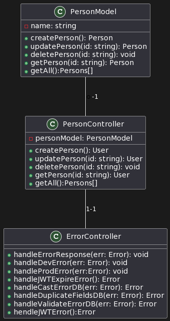

# REST API Documentation

This documentation outlines the details for the REST API developed to perform CRUD operations on a "person" resource. The API provides endpoints for creating, reading, updating, and deleting person records. It ensures secure interactions with the database to prevent common vulnerabilities like SQL injections.

## Endpoints

### CREATE: Adding a New Person

- **Endpoint:** `/api`
- **HTTP Method:** POST

#### Request Format

```json
{
    "name": "John Doe",
}
```

#### Response Format

```json
{
    "message": "User created successfully",
    "statusCode": 201,
    "time": "2023-09-13T10:30:00",
    "userId": 1
}
```

### READ: Fetching Details of a Person

- **Endpoint:** `/api/{user_id}`
- **HTTP Method:** GET

#### Response Format (Successful)

```json
{
    "id": 1,
    "name": "John Doe",
    "createdAt": "2023-09-13T10:30:00",
    "updatedAt": "2023-09-13T10:45:00"
}
```

#### Response Format (User Not Found)

```json
{
    "message": "User not found",
    "statusCode": 404,
    "time": "2023-09-13T11:00:00"
}
```

### UPDATE: Modifying Details of an Existing Person

- **Endpoint:** `/api/{user_id}`
- **HTTP Method:** PUT

#### Request Format

```json
{
    "name": "Updated Name",
}
```

#### Response Format (Successful)

```json
{
    "message": "User updated successfully",
    "statusCode": 200,
    "time": "2023-09-13T10:45:00"
}
```

#### Response Format (User Not Found)

```json
{
    "message": "User not found",
    "statusCode": 404,
    "time": "2023-09-13T11:00:00"
}
```

### DELETE: Removing a Person

- **Endpoint:** `/api/{user_id}`
- **HTTP Method:** DELETE

#### Response Format (Successful)

```json
{
    "message": "User deleted successfully",
    "statusCode": 200,
    "time": "2023-09-13T11:15:00"
}
```

#### Response Format (User Not Found)

```json
{
    "message": "User not found",
    "statusCode": 404,
    "time": "2023-09-13T11:30:00"
}
```

## Sample Usage

### Creating a New Person

**Request:**

```http
POST /api
Content-Type: application/json

{
    "name": "John Doe",
    "age": 30
}
```

**Response:**

```json
{
    "message": "User created successfully",
    "statusCode": 201,
    "time": "2023-09-13T10:30:00",
    "userId": 1
}
```

### Fetching Details of a Person

**Request:**

```http
GET /api/1
```

**Response (Successful):**

```json
{
    "id": 1,
    "message": "John Doe",
    "createdAt": "2023-09-13T10:30:00",
    "updatedAt": "2023-09-13T10:45:00"
}
```

**Response (User Not Found):**

```json
{
    "message": "User not found",
    "statusCode": 404,
    "time": "2023-09-13T11:00:00"
}
```

### Modifying Details of an Existing Person

**Request:**

```http
PUT /api/1
Content-Type: application/json

{
    "name": "Updated Name",
}
```

**Response (Successful):**

```json
{
    "message": "User updated successfully",
    "statusCode": 200,
    "time": "2023-09-13T10:45:00"
}
```

**Response (User Not Found):**

```json
{
    "message": "User not found",
    "statusCode": 404,
    "time": "2023-09-13T11:00:00"
}
```

### Removing a Person

**Request:**

```http
DELETE /api/1
```

**Response (Successful):**

```json
{
    "message": "User deleted successfully",
    "statusCode": 200,
    "time": "2023-09-13T11:15:00"
}
```

**Response (User Not Found):**

```json
{
    "message": "User not found",
    "statusCode": 404,
    "time": "2023-09-13T11:30:00"
}
```

## Known Limitations and Assumptions

- The API assumes that a person's name should contain only letters.
- The API does not support authentication or authorization. Access control should be implemented separately.
- Error messages are generic and do not provide specific details on validation failures.
- This documentation assumes that the API is deployed and accessible.

## Setup and Deployment Instructions

To set up and deploy the API locally or on a server, follow these general steps:

1. Clone the repository containing the API source code.
2. Ensure that you have Java and Maven installed on your system.
3. Configure the database connection details in the `application.properties` file.
4. Build the application using Maven: `mvn clean install`.
5. Run the application: `java -jar target/your-api.jar`.
6. The API will be accessible at `http://localhost:8080` by default. Update the base URL as needed.
7. You can deploy the API to a server by deploying the generated JAR file and configuring a production database.

Please note that specific setup and deployment steps may vary depending on your environment and deployment platform.

### Project UML Diagram
#### User UML
